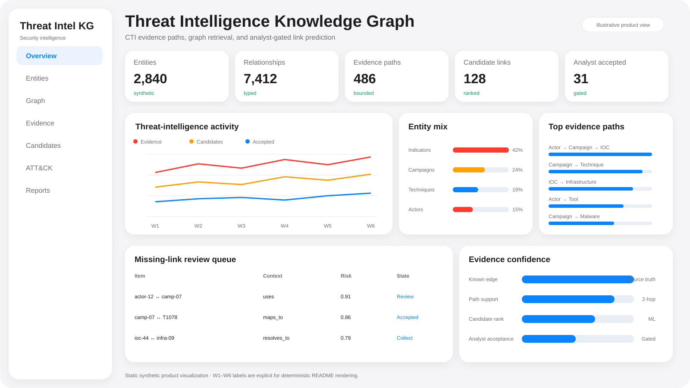
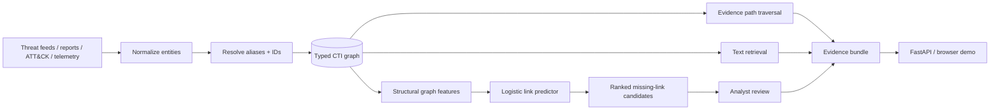

<div align="center">

# Threat Intelligence Knowledge Graph

### Evidence Paths · Graph Retrieval · Analyst-Gated Link Prediction

[](https://github.com/VinayK88/Threat-intelligence-knowledgegraph/actions/workflows/ci.yml)
[](https://www.python.org/)
[](https://fastapi.tiangolo.com/)
[](https://networkx.org/)
[](#graph-ml-link-prediction)
[](#evaluation-boundary)

> **Core question:** Which threat-intelligence relationships are supported by evidence today—and which missing relationships are structurally plausible enough for an analyst to investigate next?

</div>

---



A defensive, locally runnable CTI platform that connects threat actors, campaigns, malware, ATT&CK techniques, indicators, vulnerabilities, enterprise observations, sectors and assets into a typed graph.

The system now combines:

```text
explicit CTI relationships
        +
evidence-path traversal
        +
text retrieval
        +
graph ML candidate ranking
        ↓
analyst-verifiable intelligence context
```

**Graph ML never writes a relationship automatically.** Candidate links remain hypotheses until an analyst or trusted evidence source confirms them.

## Architecture



## What is implemented

| Capability | Implementation |
| --- | --- |
| Typed CTI entities / relationships | Pydantic models |
| Directed multi-edge graph | NetworkX `MultiDiGraph` |
| Entity investigation | inbound/outbound neighborhood expansion |
| Evidence paths | bounded directed traversal with transparent confidence |
| Lightweight retrieval | token-overlap ranking over names, aliases and descriptions |
| RAG-ready evidence | matched entities + graph paths + compact context |
| Graph ML | logistic missing-link ranking over structural features |
| Analyst boundary | candidates are advisory and never inserted automatically |
| API | FastAPI + browser investigation UI |
| CI | Python 3.10–3.12 tests + graph ML smoke tests |

## Evidence-path reasoning

The graph preserves explicit evidence rather than collapsing intelligence into one opaque score.

Example:

```text
Campaign
  ├─ uses → ATT&CK technique
  ├─ associated_with → indicator
  └─ indicator → observed_as → enterprise observation
```

Path confidence remains transparent and is calculated from the explicit relationships already present in the graph.

This is separate from ML: **known edges are evidence; predicted edges are investigation candidates.**

## Graph ML link prediction

The new graph ML layer uses a **standardized logistic-regression classifier** over eight structural features:

```text
source out-degree
target in-degree
common neighbors
Jaccard neighborhood overlap
directed two-hop paths
reverse-edge presence
same entity type
smoothed source-type → target-type prior
```

### Held-out evaluation design

The implementation creates a reproducible synthetic missing-link task:

1. Existing graph edges are positive examples.
2. An equal number of deterministic non-edges are negative examples.
3. A stratified holdout is created.
4. Held-out positive relationships are **removed from the observed graph before feature extraction**.
5. The classifier is evaluated on those unseen positive/non-edge pairs.
6. The final ranking model is refit for candidate generation.

This avoids the most obvious direct-edge leakage and makes the evaluation closer to the question the feature is meant to answer: *could the graph recover a relationship that is temporarily hidden?*

The resulting precision/recall/F1/ROC-AUC values are intentionally reported only as **synthetic pipeline validation**, not production CTI discovery accuracy.

## Candidate-link ranking

`rank_missing_links()` scores only relationships that do **not** already exist.

Each candidate includes:

- source and target IDs;
- entity types;
- model score;
- structural evidence such as shared neighbors or a two-hop path.

Example shape:

```json
{
  "source": "campaign-example",
  "target": "indicator-example",
  "source_type": "campaign",
  "target_type": "indicator",
  "probability": 0.73,
  "evidence": ["shared graph neighbors", "directed two-hop path"]
}
```

The score is a model ranking output—not verified attribution or relationship confidence.

## API

```bash
python -m venv .venv
source .venv/bin/activate
pip install -r requirements.txt
uvicorn app.main:app --reload
```

Core endpoints:

```text
GET  /graph/stats
GET  /entity/{entity_id}
GET  /paths?source=...&target=...
POST /query
GET  /observations
GET  /ml/link-candidates?limit=10
```

The browser demo now includes a **Rank missing links** action so reviewers can inspect ML hypotheses separately from normal evidence retrieval.

## Example investigation flow

```text
Analyst question
    ↓
retrieve matching CTI entities
    ↓
expand known evidence paths
    ↓
inspect internal observations
    ↓
optionally rank missing graph links
    ↓
validate candidate against trusted evidence
```

This preserves a critical CTI distinction: correlation can suggest where to look, but attribution requires evidence.

## Run tests

```bash
python -m unittest discover -s tests -v
```

GitHub Actions validates Python **3.10, 3.11 and 3.12**, including the existing graph/retrieval tests, link-prediction tests, API route, candidate-generation smoke test and module compilation.

## Data model

Representative entity types:

```text
threat_actor
campaign
malware
technique
indicator
vulnerability
observation
asset
sector
```

Representative relationships remain explicit and typed, such as `operates`, `uses`, `associated_with`, `observed_as` and `seen_on`.

## Why graph ML belongs here

Traditional text retrieval can find similar names or descriptions. Graph link prediction asks a different question:

> Given the structure of the intelligence graph, which currently absent relationships resemble relationships we have observed elsewhere?

That is useful for analyst prioritization, data-quality review, entity-resolution support and collection planning—but should not be treated as autonomous attribution.

## Production evolution

A production implementation could incorporate temporal edge features, source reliability, graph embeddings, Node2Vec-style representations, knowledge-graph embedding models, analyst accept/reject feedback, source-specific calibration, time-based validation and provenance-aware candidate explanations.

Candidate acceptance should always preserve source attribution and supporting evidence.

## Evaluation boundary

All included CTI entities, relationships, observations and ML examples are **synthetic**. The model demonstrates graph-feature engineering, missing-link evaluation and analyst-gated candidate ranking; it does not establish real-world threat-actor attribution accuracy.

The repository does not collect credentials, access production telemetry, exploit systems, or autonomously enrich external threat platforms.

---

<div align="center">

**Known edges are evidence. Predicted edges are questions worth investigating.**

</div>
