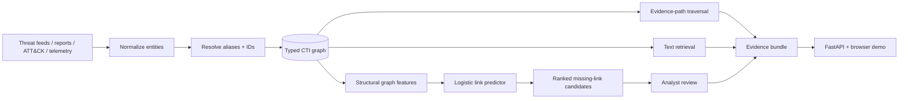

<div align="center">

# Threat Intelligence Knowledge Graph

### CTI evidence paths, graph retrieval, and analyst-gated missing-link prediction

[](https://github.com/VinayK88/Threat-intelligence-knowledgegraph/actions/workflows/ci.yml)
[](https://www.python.org/)
[](https://fastapi.tiangolo.com/)
[](https://networkx.org/)
[](#graph-ml-link-prediction)
[](#evaluation-boundary)

**Normalize → resolve → traverse → retrieve → rank → review**

[Product preview](#product-preview) · [Architecture](#architecture) · [Evidence paths](#evidence-path-reasoning) · [Graph ML](#graph-ml-link-prediction) · [Quick start](#quick-start)

</div>

---

## Product preview

<p align="center">
  
</p>

<p align="center"><em>Illustrative synthetic product view. Known edges represent evidence; predicted edges remain analyst-review candidates.</em></p>

Threat Intelligence Knowledge Graph is a defensive CTI platform for connecting actors, campaigns, malware, techniques, indicators, vulnerabilities, enterprise observations, sectors, and assets into a **typed, evidence-aware graph**.

The core question is simple:

> **Which relationships are supported by evidence today—and which missing relationships are structurally plausible enough to investigate next?**

### At a glance

| Layer | What the project demonstrates |
| --- | --- |
| CTI modeling | Typed entities and explicit relationship semantics |
| Graph storage | Directed multi-edge graph with transparent neighborhood expansion |
| Evidence retrieval | Bounded path traversal plus lightweight text retrieval |
| RAG readiness | Matched entities + graph paths + compact evidence context |
| Graph ML | Logistic missing-link ranking over structural features |
| Leakage control | Held-out positive edges removed before feature extraction |
| Analyst boundary | Candidate links are advisory and never written automatically |
| Delivery | FastAPI, browser demo, tests, and Python 3.10–3.12 CI |

## Why this project

Traditional text retrieval answers “what reports look similar?” A knowledge graph can answer a different set of questions:

- Which entities are connected through explicit evidence paths?
- What is the shortest bounded path between an actor and an indicator?
- Which relationships are absent but structurally resemble known edges?
- Which candidate links deserve analyst collection or validation next?

The project keeps **known evidence and model-generated hypotheses separate**.

## Architecture



## What is implemented

| Capability | Implementation |
| --- | --- |
| Typed CTI entities / relationships | Pydantic models |
| Directed multi-edge graph | NetworkX `MultiDiGraph` |
| Entity investigation | inbound/outbound neighborhood expansion |
| Evidence paths | bounded directed traversal with transparent confidence |
| Lightweight retrieval | token-overlap ranking over names, aliases, descriptions |
| RAG-ready context | matched entities + graph paths + compact evidence bundle |
| Graph ML | logistic missing-link ranking over structural features |
| Analyst gating | candidate links stay advisory until validated |
| API | FastAPI + browser investigation UI |
| CI | Python 3.10–3.12 tests + graph ML smoke tests |

## Evidence-path reasoning

The graph preserves explicit evidence rather than collapsing CTI into one opaque score.

Example:

```text
Campaign
  ├─ uses → ATT&CK technique
  ├─ associated_with → indicator
  └─ indicator → observed_as → enterprise observation
```

Path confidence is derived from relationships that already exist in the graph. This is intentionally separate from graph ML:

> **Known edges are evidence. Predicted edges are questions worth investigating.**

## Graph ML link prediction

The missing-link model uses a standardized logistic-regression classifier over structural features including:

```text
source out-degree
target in-degree
common neighbors
Jaccard neighborhood overlap
directed two-hop paths
reverse-edge presence
same entity type
smoothed source-type → target-type prior
```

### Held-out evaluation design

To make the synthetic task less trivial:

1. Existing edges are positive examples.
2. Deterministic non-edges provide negatives.
3. A stratified holdout is created.
4. Held-out positive edges are removed from the observed graph **before feature extraction**.
5. The classifier is evaluated on unseen positives and non-edges.
6. The final model is refit for candidate generation.

This reduces direct-edge leakage and better matches the intended question: **can structural features recover a temporarily hidden relationship?**

Any precision, recall, F1, or ROC-AUC values produced by this fixture are synthetic pipeline-validation results—not real-world attribution accuracy.

## Candidate-link ranking

`rank_missing_links()` only scores relationships that do **not** already exist.

Each candidate includes:

- source and target IDs;
- source and target entity types;
- model score;
- structural evidence such as shared neighbors or a two-hop path.

Representative output:

```json
{
  "source": "campaign-example",
  "target": "indicator-example",
  "source_type": "campaign",
  "target_type": "indicator",
  "probability": 0.73,
  "evidence": [
    "shared graph neighbors",
    "directed two-hop path"
  ]
}
```

The score is a ranking signal—not verified attribution, provenance, or relationship confidence.

## Quick start

```bash
python -m venv .venv
source .venv/bin/activate
pip install -r requirements.txt
uvicorn app.main:app --reload
```

Core endpoints:

```text
GET  /graph/stats
GET  /entity/{entity_id}
GET  /paths?source=...&target=...
POST /query
GET  /observations
GET  /ml/link-candidates?limit=10
```

Run tests:

```bash
python -m unittest discover -s tests -v
```

GitHub Actions validates Python **3.10, 3.11, and 3.12**, including graph/retrieval tests, link-prediction tests, API coverage, candidate-generation smoke tests, and module compilation.

## Example investigation flow

```text
Analyst question
    ↓
retrieve matching CTI entities
    ↓
expand known evidence paths
    ↓
inspect enterprise observations
    ↓
optionally rank missing links
    ↓
validate candidate against trusted evidence
```

This preserves a critical CTI distinction: **correlation can suggest where to look; attribution requires evidence.**

## Data model

Representative entity types:

```text
threat_actor
campaign
malware
technique
indicator
vulnerability
observation
asset
sector
```

Representative relationship types include `operates`, `uses`, `associated_with`, `observed_as`, and `seen_on`.

## Production evolution

A production implementation could add temporal edge features, source reliability, graph embeddings, Node2Vec-style representations, knowledge-graph embeddings, source-specific calibration, time-based validation, provenance-aware explanations, and analyst accept/reject feedback.

Candidate acceptance should always preserve source attribution and supporting evidence.

## Evaluation boundary

- All included entities, relationships, observations, and ML examples are synthetic.
- The graph ML layer demonstrates structural feature engineering and candidate ranking, not production CTI discovery accuracy.
- Predicted links are never inserted automatically.
- The repository does not collect credentials, exploit systems, access production telemetry, or autonomously enrich external threat platforms.

---

<div align="center">

**Known edges are evidence. Predicted edges are investigation candidates. Analysts decide what becomes knowledge.**

</div>
