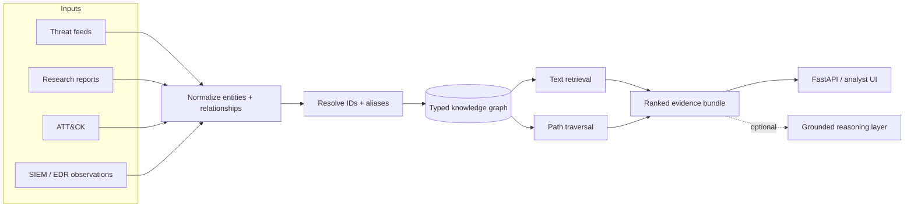
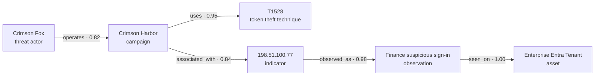
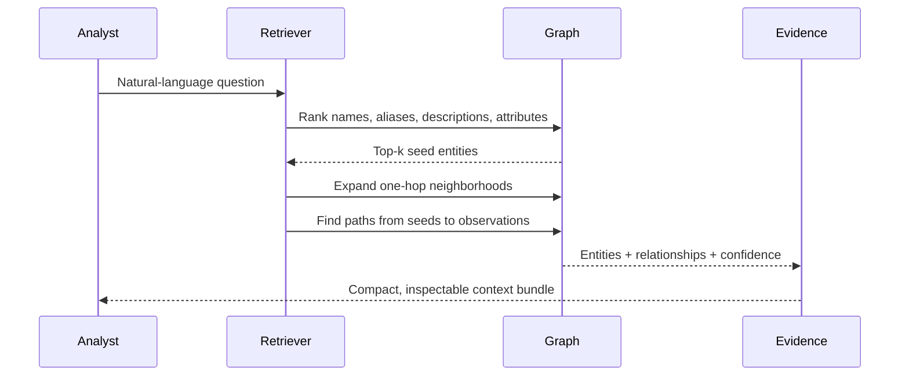
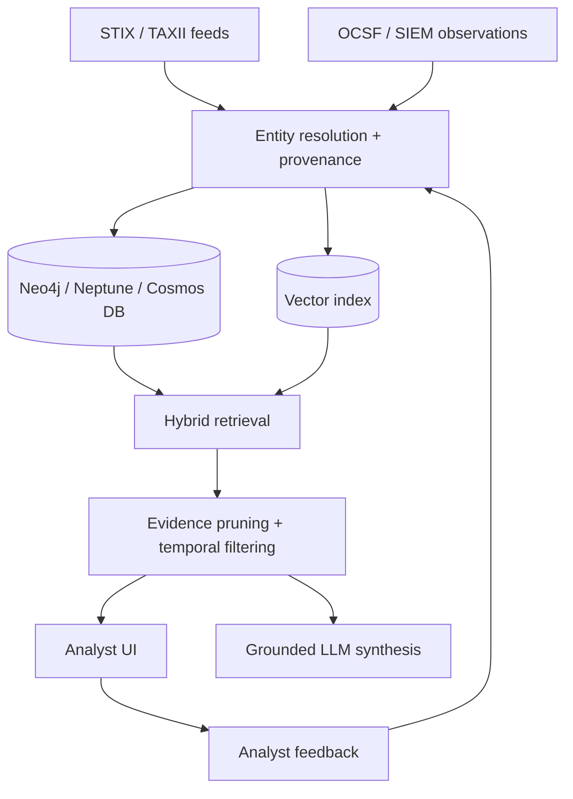

<div align="center">

# Threat Intelligence Knowledge Graph

### Turn disconnected cyber threat intelligence into evidence paths analysts can inspect

[](https://www.python.org/)
[](https://fastapi.tiangolo.com/)
[](https://networkx.org/)
[](Dockerfile)
[](LICENSE)
[](#safety)

**Entity resolution · graph traversal · confidence scoring · evidence retrieval**

[Quick start](#quick-start) · [Try the investigation flow](#investigation-walkthrough) · [Architecture](#architecture) · [Data model](#data-model)

</div>

---

A defensive, locally runnable reference implementation for graph-based cyber threat intelligence (CTI). It connects threat actors, campaigns, malware, ATT&CK techniques, indicators, vulnerabilities, enterprise observations, and assets into one typed, explainable graph.

The included dataset is entirely **synthetic**. You can run the API, inspect multi-hop paths, and test retrieval without threat-feed credentials, cloud infrastructure, or an LLM API key.

## The question this project answers

Threat intelligence often arrives as isolated facts: a domain in one feed, a malware family in a report, a technique in ATT&CK, and an alert in your SIEM. The useful question is not “do these strings match?” but:

> Which campaigns use token-theft techniques, and does any associated infrastructure overlap with observations in our environment?

This project returns a compact **evidence subgraph** instead of a pile of unrelated documents.

## Architecture



### Example evidence path

The sample graph can connect a synthetic campaign to an internal observation in two hops:



Path confidence is intentionally transparent: the graph multiplies edge confidence across a path. For example, `0.84 × 0.98 = 0.8232`.

## What is included

| Capability | Implementation |
| --- | --- |
| Typed CTI entities and relationships | Pydantic models |
| Multi-edge directed graph | NetworkX `MultiDiGraph` |
| Entity-centric investigation | Inbound/outbound neighborhood expansion |
| Explainable correlation | Bounded simple-path traversal |
| Lightweight retrieval | Token-overlap ranking over names, aliases, descriptions, and attributes |
| RAG-ready context | Matched entities + evidence paths + compact text context |
| Analyst access | FastAPI, OpenAPI docs, and a browser demo |
| Reproducibility | Synthetic JSON data and unit tests |

## Quick start

### 1. Install

```bash
git clone https://github.com/VinayK88/Threat-intelligence-knowledgegraph.git
cd Threat-intelligence-knowledgegraph

python -m venv .venv
source .venv/bin/activate        # Windows: .venv\Scripts\activate
pip install -r requirements.txt
```

### 2. Start the API

```bash
uvicorn app.main:app --reload
```

| Destination | URL |
| --- | --- |
| Browser investigation demo | <http://localhost:8000> |
| Interactive OpenAPI docs | <http://localhost:8000/docs> |
| Raw OpenAPI schema | <http://localhost:8000/openapi.json> |

### Docker alternative

```bash
docker build -t threat-intel-graph .
docker run --rm -p 8000:8000 threat-intel-graph
```

## Investigation walkthrough

### 1. Inspect the graph

```bash
curl -sS http://localhost:8000/graph/stats | python -m json.tool
```

```json
{
  "nodes": 20,
  "edges": 22,
  "entity_types": {
    "asset": 2,
    "campaign": 2,
    "indicator": 3,
    "malware": 2,
    "observation": 3,
    "sector": 2,
    "technique": 3,
    "threat_actor": 2,
    "vulnerability": 1
  }
}
```

### 2. Explore one entity's neighborhood

```bash
curl -sS http://localhost:8000/entity/campaign-harbor | python -m json.tool
```

The response contains the `Crimson Harbor` entity plus inbound and outbound neighbors, relationship names, and edge confidence.

### 3. Prove a campaign-to-observation connection

```bash
curl -sS \
  'http://localhost:8000/paths?source=campaign-harbor&target=obs-finance-signin&cutoff=3' \
  | python -m json.tool
```

```json
[
  {
    "nodes": [
      "campaign-harbor",
      "ioc-ip-77",
      "obs-finance-signin"
    ],
    "relationships": [
      "associated_with",
      "observed_as"
    ],
    "confidence": 0.8232
  }
]
```

### 4. Build a RAG-style evidence bundle

```bash
curl -sS -X POST http://localhost:8000/query \
  -H 'Content-Type: application/json' \
  -d '{
    "question": "Which token theft campaigns overlap with finance telemetry?",
    "top_k": 8
  }' | python -m json.tool
```

The response has four deliberate parts:

```json
{
  "question": "Which token theft campaigns overlap with finance telemetry?",
  "matched_entities": ["ranked entity objects"],
  "evidence_paths": ["bounded, confidence-scored paths"],
  "context": "compact entity and relationship facts for a reasoning layer"
}
```

### 5. Review enterprise observations

```bash
curl -sS http://localhost:8000/observations | python -m json.tool
```

## How retrieval works



The MVP retriever is deliberately lightweight and deterministic:

1. Tokenize the question and remove common stop words.
2. Rank entity documents by token overlap, rarity, and exact-name matches.
3. Expand one hop around the strongest seed entities.
4. Find bounded paths from seed entities to enterprise observations.
5. Deduplicate and rank paths by multiplied edge confidence.
6. Return only the compact evidence needed downstream.

This is “semantic-ish” retrieval without embeddings. The adapter boundary makes it straightforward to add a vector index later without replacing the graph.

## Data model

### Entity types

| Type | Example | Why it matters |
| --- | --- | --- |
| `threat_actor` | Crimson Fox | Attribution hypothesis |
| `campaign` | Crimson Harbor | Groups activity over time |
| `malware` | CloudHook | Tooling association |
| `technique` | T1528 | ATT&CK behavior |
| `indicator` | `198.51.100.77` | Observable infrastructure |
| `vulnerability` | Synthetic CVE | Exploitation context |
| `observation` | Suspicious sign-in | Internal evidence |
| `asset` | Entra tenant | Business/environment impact |
| `sector` | Financial Services | Targeting context |

### Relationship contract

```json
{
  "source": "campaign-harbor",
  "target": "ioc-ip-77",
  "type": "associated_with",
  "confidence": 0.84,
  "source_name": "synthetic",
  "notes": ""
}
```

Supported sample relationships include `operates`, `targets`, `uses`, `associated_with`, `exploits`, `observed_as`, and `seen_on`.

## Why graph + retrieval?

| Question type | Text/vector retrieval | Knowledge graph |
| --- | --- | --- |
| “Find reports similar to token theft” | Excellent | Possible |
| “How is this campaign connected to our asset?” | Indirect | Excellent |
| “Show the exact evidence chain” | Requires reconstruction | Native |
| “Preserve relationship confidence” | Often flattened | Native |
| “Explain why this result appeared” | Similarity score | Path + edge provenance |

In production, the strongest design uses both: semantic retrieval finds candidate entities, and graph traversal proves how they connect.

## Repository map

```text
.
├── app/
│   ├── main.py          # FastAPI routes and browser demo
│   ├── models.py        # Entity, relationship, query, and path contracts
│   ├── graph.py         # MultiDiGraph operations and path confidence
│   ├── retrieval.py     # Entity ranking and evidence construction
│   └── load_data.py     # JSON-to-graph loader
├── data/
│   └── sample_intel.json
├── tests/
│   ├── test_graph.py
│   └── test_retrieval.py
├── docs/architecture.md
├── Dockerfile
└── requirements.txt
```

Run the tests:

```bash
python -m unittest discover -s tests -v
```

## Production evolution



Recommended next steps:

- STIX 2.1 and TAXII ingestion
- Official ATT&CK ingestion and stable external IDs
- Alias clustering and analyst-overridable entity resolution
- Temporal edges, confidence decay, and source provenance
- Neo4j, Neptune, Cosmos DB, or PostgreSQL graph adapter
- Vector embeddings, hybrid ranking, and evidence pruning
- Analyst feedback, graph analytics, and campaign clustering

See [Production Architecture](docs/architecture.md) for design considerations.

## Safety

This repository is for defensive research, threat-intelligence engineering, and analyst education. All actors, campaigns, malware, indicators, observations, and vulnerabilities in the sample data are synthetic or placeholders. See [SECURITY.md](SECURITY.md).

## Contributing

Contributions are welcome. Please read [CONTRIBUTING.md](CONTRIBUTING.md), keep included data synthetic or openly redistributable, and run the tests before opening a pull request.

## License

Distributed under the [MIT License](LICENSE).
